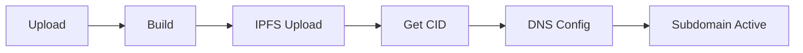

# Web3 Migration Tool 🚀

> Seamlessly migrate your Web2 frontend applications to decentralized Web3 hosting with zero crypto knowledge required.

[](https://opensource.org/licenses/MIT)
[](https://reactjs.org/)
[](https://ipfs.tech/)

The Web3 Migration Tool revolutionizes how developers deploy frontend applications to the decentralized web. With our platform, you can migrate your React, Vue, Next.js, or vanilla HTML/CSS/JS applications to IPFS hosting with just a few clicks. No crypto wallet required, and your site is instantly accessible via a personalized subdomain.

## 🌟 Core Features

| Feature | Description | Status |
|---------|-------------|--------|
| One-Click Migration | Deploy Web2 frontends to IPFS instantly | ✅ |
| Auto Subdomain | Get a custom subdomain (username.web3host.xyz) | ✅ |
| No Wallet Required | Zero crypto knowledge or wallet needed | ✅ |
| 3D Dashboard | Three.js visualization of deployed sites | ✅ |
| Multiple Framework Support | React, Vue, Next.js, HTML/CSS/JS | ✅ |
| Automated IPFS Pinning | Ensures content persistence | ✅ |
| Real-time Status | Live deployment and health monitoring | ✅ |
| Metadata Storage | Structured database for deployment info | ✅ |

## 🏗️ System Architecture

```ascii
+------------------------+     +------------------------+     +------------------------+
|                        |     |                        |     |                        |
|    Frontend Client     |     |    Backend Service    |     |    Web3 Services      |
|                        |     |                        |     |                        |
| +------------------+  |     | +------------------+  |     | +------------------+  |
| |  React Dashboard |  |     | |   Node.js API    |  |     | |   IPFS Storage   |  |
| +------------------+  |     | +------------------+  |     | +------------------+  |
| |   Three.js UI    |  |     | |  Auth Service   |  |     | |  DNS Management  |  |
| +------------------+  |     | +------------------+  |     | +------------------+  |
| |  Upload Manager  |  |     | | Database Layer   |  |     | |  Content Pinning  |  |
| +------------------+  |     | +------------------+  |     | +------------------+  |
|                        |     |                        |     |                        |
+------------------------+     +------------------------+     +------------------------+
           ▲                             ▲                             ▲
           |                             |                             |
           ▼                             ▼                             ▼
+------------------------+     +------------------------+     +------------------------+
|    User Interface      |     |     API Gateway       |     |   Decentralized Web   |
+------------------------+     +------------------------+     +------------------------+
```

## 🔄 Workflow

### Deployment Process

1. **Upload Project**
   - Compress your frontend project
   - Upload through drag-and-drop interface
   - Automatic framework detection

2. **Configuration**
   - Choose subdomain name
   - Set build parameters (if needed)
   - Configure custom settings

3. **Build & Deploy**
   - Automatic build process
   - IPFS upload and pinning
   - DNS configuration
   - Subdomain assignment

4. **Monitor**
   - Real-time deployment status
   - Performance metrics
   - Availability tracking

## 🛠️ Tech Stack

### Frontend
- React.js
- Three.js for 3D visualization
- Material-UI components
- Redux for state management

### Backend
- Node.js
- Express.js
- MongoDB
- JWT authentication

### Web3/Infrastructure
- IPFS
- Cloudflare DNS
- Docker containers
- GitHub Actions for CI/CD

## 📊 Database Schema

```json
{
  "deployments": {
    "id": "ObjectId",
    "userId": "ObjectId",
    "subdomain": "String",
    "ipfsCID": "String",
    "createdAt": "Timestamp",
    "status": "String",
    "framework": "String",
    "metrics": {
      "uptime": "Number",
      "lastPinged": "Timestamp",
      "totalVisits": "Number"
    }
  }
}
```

## 🌐 Subdomain Deployment Flow



## 🔥 Differentiators

- **No Crypto Required**: Unlike other Web3 hosting platforms, we don't require users to own cryptocurrency or manage wallets
- **Automated Migration**: One-click deployment with automatic framework detection
- **Visual Management**: 3D dashboard for intuitive site management
- **Enterprise Ready**: Built for scale with professional monitoring tools

## 🔌 API Structure

### Endpoints

```json
{
  "api": {
    "deployments": {
      "POST /api/v1/deployments": "Create new deployment",
      "GET /api/v1/deployments": "List all deployments",
      "GET /api/v1/deployments/:id": "Get deployment details",
      "DELETE /api/v1/deployments/:id": "Remove deployment"
    },
    "subdomains": {
      "POST /api/v1/subdomains/verify": "Check subdomain availability",
      "POST /api/v1/subdomains/configure": "Set up subdomain"
    }
  }
}
```

## 📁 Project Structure

```
web3-migration-tool/
├── frontend/
│   ├── src/
│   │   ├── components/
│   │   ├── pages/
│   │   ├── services/
│   │   └── utils/
│   └── public/
├── backend/
│   ├── src/
│   │   ├── controllers/
│   │   ├── models/
│   │   ├── services/
│   │   └── utils/
│   └── tests/
└── infrastructure/
    ├── docker/
    ├── scripts/
    └── terraform/
```

## 🗺️ Roadmap

### Phase 1
- [ ] Multi-framework support expansion
- [ ] Custom domain integration
- [ ] Advanced analytics dashboard

### Phase 2
- [ ] Automatic SSL certification
- [ ] Team collaboration features
- [ ] CI/CD pipeline integration

### Phase 3
- [ ] Multi-chain storage options
- [ ] Advanced security features
- [ ] Enterprise deployment options

## 🎯 Vision

Our vision is to bridge the gap between Web2 and Web3, making decentralized hosting accessible to every developer regardless of their blockchain experience. We believe in a future where deploying to the decentralized web is as simple as traditional hosting, while maintaining the benefits of decentralization.

## 👥 Author & Contact

**Created by:** Megh Vyas  
**GitHub:** [@MeghVyas3132](https://github.com/MeghVyas3132)

## 📜 License

This project is licensed under the MIT License - see the [LICENSE](LICENSE) file for details.

---

<p align="center">Made with ❤️ for the decentralized web</p>
